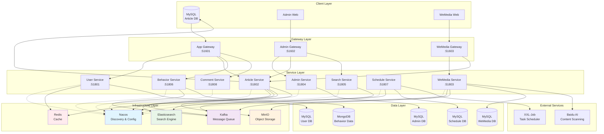

# Cloud-Native WeMedia Platform

## Overview

A complete microservice platform for a modern news and content-creation business. It handles everything from user authentication and article creation to AI-powered content moderation and dynamic news feeds. This enterprise-grade system demonstrates cloud-native architecture patterns with Spring Cloud, microservices communication, real-time processing, and scalable content management.

## Architecture Overview



## Module Breakdown

| Module | Description |
|--------|-------------|
| **media-platform-common** | Shared utilities, constants, exception handling, and common configurations |
| **media-platform-model** | Data models, DTOs, POJOs, and entity classes for all services |
| **media-platform-utils** | Common utility classes for JWT, encryption, file handling, and data processing |
| **media-platform-feign-api** | Feign client interfaces for inter-service communication with fallback implementations |
| **media-platform-basic** | Basic starter configurations and auto-configuration classes |
| **media-platform-user** | User management service handling authentication, registration, and user profiles |
| **media-platform-article** | Article management service for content creation, publishing, and static page generation |
| **media-platform-wemedia** | Content creator service for media management, automated scanning, and content moderation |
| **media-platform-admin** | Admin management service for platform administration and content review |
| **media-platform-search** | Search service powered by Elasticsearch for content discovery and recommendations |
| **media-platform-behavior** | User behavior tracking service for analytics and personalization |
| **media-platform-schedule** | Scheduled task service for delayed operations and batch processing |
| **media-platform-comment** | Comment service for user interactions and social features |
| **media-platform-app-gateway** | API Gateway for mobile applications with authentication and routing |
| **media-platform-admin-gateway** | API Gateway for admin panel with enhanced security and access control |
| **media-platform-wemedia-gateway** | API Gateway for content creator platform with specialized routing |

## Key Technologies

- **Framework**: Spring Boot 2.3.9, Spring Cloud Hoxton.SR10
- **Service Discovery**: Nacos for service registration and configuration management
- **Database**: MySQL 5.7+ with MyBatis Plus ORM
- **Message Queue**: Apache Kafka for asynchronous processing and event streaming
- **Search Engine**: Elasticsearch for full-text search and content recommendations
- **Cache**: Redis for session management and performance optimization
- **File Storage**: MinIO for object storage and static resource management
- **Content Security**: Baidu AI for automated text and image content scanning
- **Job Scheduling**: XXL-Job for distributed task scheduling
- **API Documentation**: Knife4j (Swagger) for interactive API documentation
- **Template Engine**: Freemarker for static HTML generation
- **OCR**: Tesseract (Tess4j) for image text extraction

## System Features

### 🔐 **Security & Authentication**
- JWT-based authentication with token refresh
- Role-based access control (RBAC)
- Gateway-level security filtering
- Encrypted password storage

### 📰 **Content Management**
- Rich text article creation and editing
- Automated content moderation with AI
- Static HTML generation for performance
- Image and media file management
- Content version control

### 🔍 **Search & Discovery**
- Elasticsearch-powered full-text search
- Real-time content indexing
- Personalized content recommendations
- Advanced filtering and sorting

### 📊 **Analytics & Behavior**
- User behavior tracking and analysis
- Real-time content performance metrics
- Engagement analytics dashboard
- A/B testing support

### ⚡ **Performance & Scalability**
- Microservice architecture for horizontal scaling
- Redis caching for improved response times
- Asynchronous processing with Kafka
- Load balancing with multiple gateway instances

## Setup Instructions

### Prerequisites
- Java 11 or higher
- Maven 3.6+
- MySQL 5.7+
- Redis 6.0+
- Elasticsearch 7.x
- Apache Kafka 2.8+
- Nacos 2.0+
- MinIO (optional for file storage)

### 1. Infrastructure Setup

#### Start Nacos (Service Discovery & Configuration)
```bash
# Download and start Nacos
./nacos/bin/startup.sh -m standalone
# Access: http://localhost:8848/nacos (nacos/nacos)
```

#### Start MySQL and Create Databases
```bash
# Import database schemas
mysql -u root -p < mysql/media-platform_user.sql
mysql -u root -p < mysql/media-platform_article.sql
mysql -u root -p < mysql/media-platform_wemedia.sql
mysql -u root -p < mysql/media-platform_admin.sql
mysql -u root -p < mysql/media-platform_schedule.sql
```

#### Start Redis
```bash
redis-server
```

#### Start Kafka
```bash
# Start Zookeeper
bin/zookeeper-server-start.sh config/zookeeper.properties

# Start Kafka
bin/kafka-server-start.sh config/server.properties
```

#### Start Elasticsearch
```bash
./bin/elasticsearch
```

### 2. Service Configuration in Nacos

Access Nacos console at `http://localhost:8848/nacos` and create configuration files for each service:

- Data ID: `media-platform-user-dev.yml`
- Data ID: `media-platform-article-dev.yml`
- Data ID: `media-platform-wemedia-dev.yml`
- And so on for each service...

### 3. Build and Start Services

#### Build the entire project
```bash
mvn clean compile -DskipTests
mvn clean package -DskipTests
```

#### Start services in order:

1. **Core Services** (Start first)
```bash
# User Service
cd media-platform-service/media-platform-user
mvn spring-boot:run

# Article Service  
cd media-platform-service/media-platform-article
mvn spring-boot:run
```

2. **Supporting Services**
```bash
# WeMedia Service
cd media-platform-service/media-platform-wemedia
mvn spring-boot:run

# Search Service
cd media-platform-service/media-platform-search
mvn spring-boot:run

# Schedule Service
cd media-platform-service/media-platform-schedule
mvn spring-boot:run
```

3. **Gateway Services** (Start last)
```bash
# App Gateway
cd media-platform-gateway/media-platform-app-gateway
mvn spring-boot:run

# Admin Gateway
cd media-platform-gateway/media-platform-admin-gateway  
mvn spring-boot:run

# WeMedia Gateway
cd media-platform-gateway/media-platform-wemedia-gateway
mvn spring-boot:run
```

### 4. Access Points

- **Mobile App API**: http://localhost:51601
- **Admin Panel API**: http://localhost:51602  
- **WeMedia Platform API**: http://localhost:51603
- **Nacos Console**: http://localhost:8848/nacos
- **API Documentation**: http://localhost:51601/doc.html

## Development Guide

### Running Individual Services
```bash
# Run specific service
cd media-platform-service/media-platform-[service-name]
mvn spring-boot:run

# Run with specific profile
mvn spring-boot:run -Dspring-boot.run.profiles=dev
```

### Testing
```bash
# Run all tests
mvn test

# Run tests for specific module
mvn test -pl media-platform-service/media-platform-user
```

### Building for Production
```bash
# Build all modules
mvn clean package -Pprod -DskipTests

# Build Docker images (if Docker profiles configured)
mvn clean package -Pdocker -DskipTests
```

## Project Structure
```
Cloud-Native-WeMedia-Platform/
├── media-platform-common/          # Shared utilities and configurations
├── media-platform-model/           # Data models and DTOs
├── media-platform-utils/           # Common utility classes
├── media-platform-feign-api/       # Inter-service communication interfaces
├── media-platform-basic/           # Basic configurations and starters
├── media-platform-service/         # Business service modules
│   ├── media-platform-user/        # User management service
│   ├── media-platform-article/     # Article management service
│   ├── media-platform-wemedia/     # Content creator service
│   ├── media-platform-admin/       # Admin service
│   ├── media-platform-search/      # Search service
│   ├── media-platform-behavior/    # Behavior tracking service
│   ├── media-platform-schedule/    # Scheduled task service
│   └── media-platform-comment/     # Comment service
├── media-platform-gateway/         # API Gateway modules
│   ├── media-platform-app-gateway/     # Mobile app gateway
│   ├── media-platform-admin-gateway/   # Admin panel gateway
│   └── media-platform-wemedia-gateway/ # WeMedia platform gateway
├── media-platform-test/            # Test modules and demos
├── mysql/                          # Database schemas and migration scripts
├── docs/                          # Additional documentation
└── html/                          # Frontend applications (if applicable)
```

## Contributing

1. Follow the existing code style and package structure
2. Add comprehensive unit tests for new features  
3. Update documentation for API changes
4. Ensure all services pass integration tests
5. Use conventional commit messages

## License

This project is developed for educational and demonstration purposes, showcasing enterprise-level microservice architecture patterns and modern Java development practices.